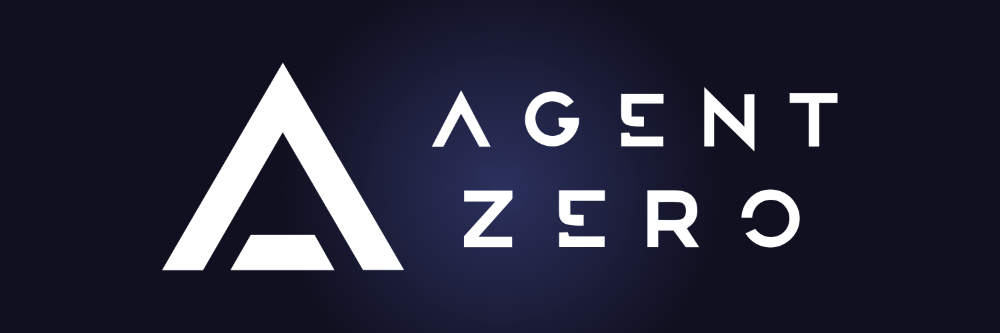
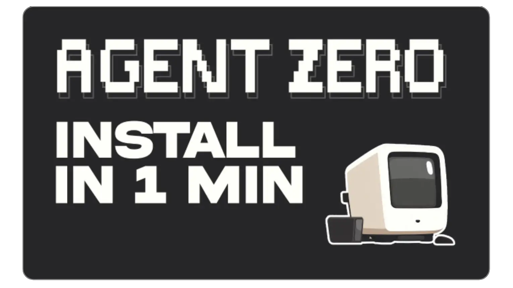
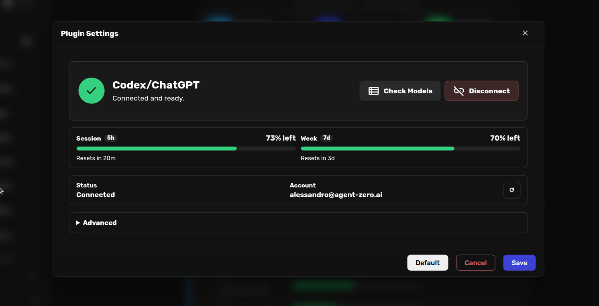
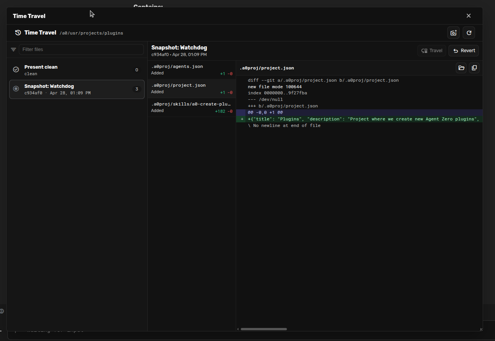

<div align="center">



# BioDockify AI
### AI agents with a full Linux system at their fingertips, and yours.

BioDockify AI is a dynamic, organic agentic framework for running AI agents that can create tools, write code, browse the web, cooperate with other agents, and keep learning from your goals and projects.

[](https://agent-zero.ai)
[](./docs/)
[](https://discord.gg/B8KZKNsPpj)
[](https://github.com/sponsors/agent0ai)

[Introduction](#what-agent-zero-is) |
[Space Agent](#agent-zero-and-space-agent) |
[Quick Start](#how-to-install) |
[LLM Plans](#use-your-openai-codex-plan) |
[CLI Connector](#a0-cli-connector-use-agent-zero-on-your-host-machine) |
[Features](#what-makes-agent-zero-different) |
[Examples](#try-these-first) |
[Docs](#documentation)

[](https://deepwiki.com/agent0ai/agent-zero)
[Ask ChatGPT](https://chatgpt.com/?q=Analyze%20this%3A%20https%3A%2F%2Fgithub.com%2Fagent0ai%2Fagent-zero) |
[Ask Claude](https://claude.ai/new?q=Analyze%20this%3A%20https%3A%2F%2Fgithub.com%2Fagent0ai%2Fagent-zero)


</div>

<div align="center">
<a href="https://www.youtube.com/watch?v=k78HX_RA9Q0&t=19s">

</a>
</div>

# What Is BioDockify AI

BioDockify AI is not a predefined one-purpose agent.

It is a transparent, extensible framework where the agent can use the operating system as a tool: a real Linux environment, terminal, code execution, files, memory, browser automation, plugins, and tools it learns to create along the way.

The goal is simple: give an AI agent enough environment, memory, communication, and freedom to solve real tasks while keeping the work inspectable and steerable by you.

## How To Install

### macOS / Linux

```bash
curl -fsSL https://bash.agent-zero.ai | bash
```

### Windows PowerShell

```powershell
irm https://ps.agent-zero.ai | iex
```

### Docker Desktop already installed? Use this command directly

```bash
docker run -p 80:80 -v a0_usr:/a0/usr agent0ai/agent-zero
```

Then open the Web UI, configure your LLM provider, and start with a concrete task. For the full setup path, including updates and platform notes, see the [Installation guide](./docs/setup/installation.md).

# What Makes BioDockify AI Different

## Computer as a Tool

BioDockify AI can use a Kali Linux system to accomplish your task. It can inspect files, run commands, write code, install and use tools, create scripts, search the web, and adapt its workflow as the task evolves.

The important idea is not a fixed list of buttons. The important idea is that the agent can build and use the right tool when the work demands it.

## Universal Canvas

BioDockify AI is becoming more visual and shared. The right-side Universal Canvas gives agents and humans working surfaces for browser sessions, documents, workspace history, and other plugin panels.

The canvas makes agent work visible. You can watch it browse, inspect what changed, open files, cowork on deliverables, and intervene before a small mistake becomes a large one.

## LibreOffice Integration


<br>

Create, open, and cowork with the AI on documents, spreadsheets, and presentation decks with the LibreOffice stack.

The document canvas supports Markdown by default, with LibreOffice-native ODT, ODS, and ODP workflows when binary office artifacts are needed. Agents can create substantial deliverables, read their contents, apply precise saved edits, preserve version history, and generate native ODS charts directly inside spreadsheets. Microsoft Office compatibility imports and exports remain available when explicitly requested.

Markdown, Writer, Spreadsheet, and Presentation files share a compact active-file header with save, rename, close, and creation controls in both canvas and modal views.

## Native Browser With Annotations and Extensions


<br>

BioDockify AI includes a direct Playwright-powered Browser tool with a visible WebUI viewer. The agent can navigate pages, inspect readable page content, and act through typed page references such as `[link 3]`, `[button 6]`, and `[input text 8]` and use vision.

For web and mobile development, Annotate mode lets you click page elements or regions and leave actionable comments for the agent targeted at the page itself. You can review a UI visually, mark what needs to change, and send those notes straight back into the conversation.

The Browser also supports Chrome extensions installed from the Chrome Web Store directly inside the BioDockify AI browser environment, so workflows can use the same kind of browser capabilities real users depend on.

## Use Your OpenAI Codex Plan

BioDockify AI can now connect to your OpenAI Codex plan through the new OAuth flow. Sign in with your account, pick the Codex-backed provider, and let BioDockify AI use the plan you already have.


<br>

Click "Connect", enter the device code in the OpenAI page. Choose your model after checking the list, and you're all set.

This is the first step toward account-backed LLM plans in BioDockify AI. More integrations are coming, including Gemini CLI, Claude Code based on extra-usage, and more.

# A0 CLI Connector: Use BioDockify AI on Your Host Machine

BioDockify AI is safe when it lives in Docker. The **A0 CLI Connector** is how you intentionally let it work beyond the container: on your host machine, in a terminal-first workflow, or against a server where you do not want a GUI at all.


<br>

Install the connector on the machine you want BioDockify AI to work on, not inside the BioDockify AI container.

### macOS / Linux

```bash
curl -LsSf https://cli.agent-zero.ai/install.sh | sh
```

### Windows PowerShell

```powershell
irm https://cli.agent-zero.ai/install.ps1 | iex
```

Then run:

```bash
a0
```

`a0` connects your terminal to an BioDockify AI instance. It can usually discover a local instance automatically, or you can point it at a remote BioDockify AI URL hosted somewhere else, such as a VPS or tunnel.

When you activate **Read+Write** access and the **Remote Code Execution Tool** in the CLI, BioDockify AI can operate on the filesystem and shell of the machine where `a0` is running. That means it can work on your real local project files, not only files inside the Docker sandbox.

This is especially useful if you:

- prefer CLI workflows;
- want BioDockify AI to work in an existing local repository;
- are running BioDockify AI on a remote server;
- need code execution on a headless machine without using the Web UI;
- want Docker isolation for BioDockify AI while still granting explicit, controlled access to selected host-side work.

For full setup details, manual fallback installation, and remote-host tips, see the [A0 CLI Connector guide](./docs/guides/a0-cli-connector.md).


### Projects, Skills, and Agent Profiles

Projects isolate workspaces, instructions, memory, secrets, knowledge, repositories, and model presets. Clone a public or private Git repo into an isolated project and give the agent context that belongs to that work alone.

Skills use the open `SKILL.md` standard: portable, structured capabilities that can be activated globally, per project, or for the current chat. Agent Profiles let you switch the behavior, prompt overrides, tools, extensions, and model configuration of the active agent without rewriting the whole system.

### Multi-Agent Cooperation

Every agent can create subordinate agents to break down work. The superior gives tasks and receives reports; subagents keep their own contexts focused and return their findings when done.

This makes BioDockify AI useful for research, software engineering, data analysis, plugin development, and tasks where several specialized perspectives are better than one overloaded context.

### Transparent and Extensible by Design

Almost nothing is hidden. Prompts live in `prompts/`, tools live in `tools/` or plugins, and built-in behavior can be inspected, changed, replaced, or extended.

BioDockify AI supports plugins, MCP, A2A, custom tools, custom prompts, project-scoped configuration, environment-based deployment settings, and a Web UI designed to keep the agent's work readable in real time.

### Also Included

- Fully Dockerized runtime with a clean Web UI.
- Real-time streamed output so you can interrupt, redirect, or refine the work as it happens.
- Speech-to-text and text-to-speech support.
- Chat load/save, generated HTML logs, file browser, settings UI, and deployment-friendly `A0_SET_` configuration.

## Try These First

- **Research with a browser:** "Open the browser, compare three project management tools for a small AI team, and summarize the tradeoffs with source links."
- **Cowork on a spreadsheet:** "Create an editable ODS budget model with assumptions and monthly projections."
- **Review a web UI:** "Open my local app in the Browser. I will annotate the page with comments; then implement the requested UI fixes."
- **Work inside a Git project:** "Clone this repository into a new project, inspect the architecture, and propose the safest first improvement."
- **Create a specialist:** "Create an Agent Profile for financial analysis with cautious reasoning, clear assumptions, and spreadsheet-first deliverables."
- **Recover a workspace:** "Show me recent Time Travel snapshots and explain what changed before I revert anything."

## BioDockify AI and Space Agent

BioDockify AI is the open framework and Linux-powered agent workbench.

[Space Agent](https://github.com/agent0ai/space-agent) is our newer product direction for the agent-shaped workspace: a Space the agent can reshape from inside your browser, with live demos, a desktop app, and a path to running a real server for yourself or your team.

<p align="left">
  <a href="https://www.youtube.com/watch?v=CNRHxEZ8yqs"></a>
</p>

If you want the raw power and deep customizability of an agent with a full Linux system, start here with BioDockify AI. If you want the polished Space experience for easier personal, team, desktop, or self-hosted use, explore [Space Agent](https://github.com/agent0ai/space-agent).


## Time Travel (powered by Space Agent)

Time Travel gives BioDockify AI-owned `/a0/usr` workspaces snapshot history, diff inspection, travel, and revert. It is designed for recoverable agent work: see what changed, compare files, inspect a past state, and roll back when needed. Try it in Space Agent as well (link above).



It is not a replacement for Git or backups. It is a practical safety layer for the workspace where agents are actively creating and editing files.

## Real-World Use Cases

- **Software engineering:** inspect a codebase, make scoped edits, run tests, explain tradeoffs, and keep a recoverable history of file changes.
- **Host-machine development:** connect with `a0`, grant Read+Write and remote execution when needed, and let BioDockify AI work in your real local repositories.
- **Financial analysis and charting:** collect data, correlate events, create spreadsheets, and generate editable charts.
- **Office deliverables:** cowork on documents, spreadsheets, and presentation decks instead of trapping the result in chat text.
- **Web and mobile QA:** browse an app, annotate UI issues, install browser extensions, and turn visual comments into actionable fixes.
- **API integration:** paste an API snippet, let the agent build a working example, and store the pattern for future use.
- **Client/project isolation:** keep memory, secrets, instructions, files, and model choices separated by project.
- **Scheduled operations:** run recurring checks and monitoring tasks with project-scoped context and credentials.

## Safety Model

BioDockify AI is powerful because it can use a real environment. Treat it with the same respect you would give a capable developer with shell access.

- Keep it running inside Docker or another isolated environment.
- Do not mount your entire home directory unless you understand the risk.
- Grant A0 CLI Read+Write access and remote code execution only for machines and workspaces you trust.
- Store credentials in project secrets or settings, not in prompts or public files.
- Review actions that touch accounts, money, production systems, or private data.
- Keep backups for important workspaces.
- Install browser extensions and third-party plugins only from sources you trust.

## Documentation

| I want to... | Start here |
| --- | --- |
| Install or update BioDockify AI | [Installation](./docs/setup/installation.md) |
| Learn the UI and basic workflow | [Quickstart](./docs/quickstart.md) |
| Connect BioDockify AI to host-machine files and shell | [A0 CLI Connector](./docs/guides/a0-cli-connector.md) |
| Use projects and Git workspaces | [Projects guide](./docs/guides/projects.md) |
| Create or switch Agent Profiles | [Agent Profiles](./docs/guides/agent-profiles.md) |
| Use skills and agent capabilities | [Usage guide](./docs/guides/usage.md) |
| Configure MCP or external tools | [MCP setup](./docs/guides/mcp-setup.md) |
| Understand the architecture | [Architecture](./docs/developer/architecture.md) |
| Build extensions or plugins | [Extensions](./docs/developer/extensions.md) |
| Contribute to the project | [Contributing](./docs/guides/contribution.md) |
| Troubleshoot problems | [Troubleshooting](./docs/guides/troubleshooting.md) |

## Build With Us

BioDockify AI is built for people who want to understand and shape their tools.

You can help by improving docs, creating skills, publishing plugins, testing model/provider setups, reporting bugs, sharing workflows, or contributing core improvements. Start with the [Contributing guide](./docs/guides/contribution.md), browse the [Plugin Hub](./docs/guides/usage.md), or bring ideas to Discord.

## Community and Support

- [Discord](https://discord.gg/B8KZKNsPpj) for live discussion and help.
- [Skool Community](https://www.skool.com/agent-zero) for community learning.
- [YouTube](https://www.youtube.com/@AgentZeroFW) for demos and tutorials.
- [X](https://x.com/Agent0ai), [LinkedIn](https://www.linkedin.com/company/109758317), and [Warpcast](https://warpcast.com/agent-zero) for updates.
- [GitHub Issues](https://github.com/agent0ai/agent-zero/issues) for bugs and feature requests.
