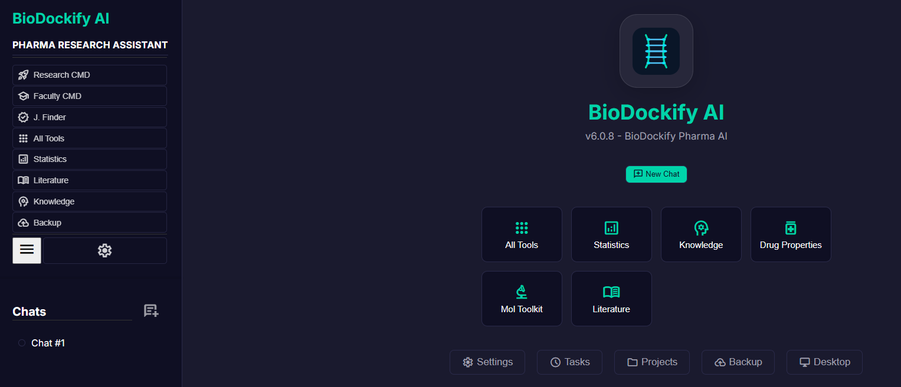

# BioDockify Pharma AI

<h1 align="center">🧬 BioDockify Pharma AI</h1>

<h3 align="center">AI Research Assistant for Pharmaceutical Sciences</h3>

<p align="center">
  <a href="https://hub.docker.com/r/tajo9128/biodockify-pharma-ai"></a>
  <a href="https://github.com/tajo9128/BioDockify-Pharma-AI/releases"></a>
  <a href="https://github.com/tajo9128/BioDockify-Pharma-AI"></a>
  <a href="LICENSE"></a>
  <a href="docs/user-guide/README.md"></a>
</p>

<p align="center">
  
</p>

**BioDockify Pharma AI** is a pharmaceutical research platform built on the **Agent Zero v2.0** core, with **22+ integrated modules** covering all 8 pharmacy departments. It features AutoDock Vina molecular docking with MM-GBSA free energy scoring, **56 biostatistics analysis types** (SPSS/jamovi-level), **12 advanced Academic Writer skills** (EQUATOR reporting guidelines, PRISMA systematic review pipeline, per-section quality scoring, De-AIGC rewrite, claim verification), **7-level drug interaction database** (50+ clinically significant pairs), **Perplexity-style citation system** with hybrid search (BM25 + FAISS + RRF), Obsidian bidirectional sync, a Knowledge Base with retrieval-grounded RAG chat, an Academic Writer with pharma-specific claim verification and ICH compliance checks, a 36,145-journal recommender, 4 AI sub-agents, and bulletproof backup to PC.

---

## Fork Attribution

**BioDockify Pharma AI** is a pharmaceutical research fork of [Agent Zero](https://github.com/agent0ai/agent-zero), an open-source agentic framework created and maintained by [Jan Tomasek](https://github.com/Xrenel) and the Agent Zero team.

> **BioDockify Pharma AI is NOT standalone software.** It is built on Agent Zero, which is free and open-source. All core framework functionality, architecture, and capabilities belong to [Agent Zero](https://github.com/agent0ai/agent-zero).
>
> We thank Jan Tomasek and the Agent Zero team for their dedication to open AI software.

---

## Features

### BioDockify AI Engine — Local LLM Support

**Runs fully offline. No cloud. No API spend. No PHI/compound data egress.**

BioDockify supports any OpenAI-compatible local LLM through its AI Engine module. Bonsai-8B is one model option (installed separately), but you can use any model via Ollama, LM Studio, or any OpenAI-compatible server.

| Feature | Details |
|---------|---------|
| **Supported models** | Any OpenAI-compatible model via Ollama, LM Studio, vLLM, mlx_lm.server, or llama.cpp |
| **Setup** | Install Ollama/LM Studio on host → set in Settings → Models. Works fully offline. |
| **Pharma Prompt Library** | 8 domain templates: Literature Review, MOA, Docking, ADMET, Claims, Thesis, ICH Compliance |
| **In-app panel** | Right-canvas rail → "BioDockify AI Engine" (brain icon) → 4 tabs: Status, Models, Runtimes, Benchmark |
| **Benchmark** | Built-in tok/s test with Good/OK/Slow verdict |
| **Model catalog** | Data-driven (`modules/local_llm/models.json`) — adding models is a JSON edit, zero code changes |
| **Runtime registry** | Data-driven (`modules/local_llm/runtimes.json`) — host Ollama, host LM Studio, future vLLM, future MLX |
| **Privacy** | No telemetry, no egress, HIPAA/GDPR friendly, fully reproducible thesis work |
| **Smoke tests** | 27/27 pass (`tests/test_local_llm.py`) |

### 31 Consolidated Research Modules

| # | Module | Function | Backend |
|---|--------|----------|---------|
| 1 | **Research Command Center** | Auto-research pipeline + Literature Search + Wet Lab tracking | 23 REST endpoints |
| 2 | **Molecular Toolkit** | ADMET + Docking (Vina + MM-GBSA) + Inline 3D Analysis (interactions, clusters, residue energy) | RDKit + Vina + Meeko |
| 3 | **Statistics** | **56 analysis types** + auto-analyze + PDF report with BioDockify letterhead | scipy + pandas + matplotlib |
| 4 | **Academic Writer** | 8-tab: Lit Review, Paper, Thesis (PhD/M.Pharm/B.Pharm/Pharm.D), Grant, Regulatory, Citation, Lecture, Slides + **"Use KB Sources"** button (loads by category, 100K char budget, real citations from KB) + **Pharma Scorecard** (8 dimensions) + **Claim Verification** (6 pharma claim types) | Thesis + Slides + Grant APIs + KB integration |
| 5 | **Faculty CMD** | 9 tabs: Syllabus, Lectures, Tasks, Semester, Lesson, Notes, Slides, Plagiarism, Questions | faculty_tools |
| 6 | **Journal Finder** | 36,145 journals + verify + deep research + fake detector + dossier | journals.db + 6 live APIs |
| 7 | **QSAR Modeler** | 6 regression + 3 classification, batch predict, read-across, feature selection | RDKit + scikit-learn |
| 8 | **Pharmacophore** | 5 tabs: Protein-based, Screen, Batch, Models, Target ID | RDKit |
| 9 | **Drug Analysis** | 3Dmol.js viewer + Properties (hERG/AMES/pKa/BBB) + Filters + Optimization + PubChem | RDKit + PubChem |
| 10 | **Docking Analysis** | 3D receptor+ligand viewer, interactions, PLIF, clusters, external file upload | 3Dmol.js + RDKit |
| 11 | **Knowledge Base** | Open Notebook LM-style: Notebooks, Sources, Notes, Chat, AI transformations, podcast, source filters (by module + time), category sidebar, DOCX export, full text extraction (PDF/DOCX/XLSX) | auto_store |
| 13 | **System Health** | Platform-aware health badges (Vina/MM-GBSA/RDKit/Meeko), Docker vs Windows | health.py |
| 14 | **Deep Research** | 5-database collection (PubMed, S2, Crossref, OpenAlex, arXiv), relevance scanning | 5 live APIs |
| 15 | **Backup & Recovery** | Full system backup/restore + Save to PC + Restore from PC + daily auto-backup | backup APIs |
| 16 | **Formulation Lab** | Release kinetics (5 models), dissolution f2, nanoparticle, ICH stability, excipients, DOE/RSM | scipy + numpy |
| 17 | **Clinical Pharmacy** | DDI (15 pairs), TDM, renal dose (CKD-EPI), hepatic (Child-Pugh), Naranjo ADR | drug DB |
| 18 | **Pharma Analysis** | ICH Q2(R2) validation, f2, forced degradation, chromatography, LOD/LOQ | ICH methods |
| 19 | **Natural Products** | Phytochemical screening (7 classes), extraction yield, IC50 4PL, plant DB, dereplication | RDKit |
| 20 | **Regulatory Affairs** | eCTD/CTD structure, 40+ ICH guidelines, stability planner, BE report, IND/NDA checklists | ICH database |
| 21 | **Pharmacology** | Receptor binding (Kd/Bmax), dose-response 4PL (EC50/IC50), Schild pA2, operational model (τ/KA), selectivity, receptor DB, in-vivo design, **NCA PK/PD analysis** | scipy + RDKit |
| 22 | **Medicinal Chemistry** | Murcko scaffolds, MMPA, Butina clustering, SMARTS search, SA score, retrosynthesis, named reactions, protecting groups, toxicophore scan, stereo analysis | RDKit |
| 23 | **Molecule Designer** | Generative chemistry: BRICS recombination, genetic algorithm optimization, scaffold enumeration, multi-objective scoring (QED/SA/Lipinski) | RDKit |
| 24 | **Target Identification** | Disease-target search (OpenTargets/UniProt/ChEMBL), gene lookup, pathway enrichment, druggability assessment | live APIs + local fallback |
| 25 | **Bioactivity Predictor** | IC50/pIC50 prediction per target class (RF on ECFP4), similar actives search, activity cliff/SAR analysis | RDKit + scikit-learn |
| 26 | **Retrosynthesis Planner** | Multi-step route planning (BRICS + reaction templates), disconnection analysis, complexity score, building block lookup | RDKit |
| 27 | **Structure Draw (ChemCanvas Studio)** | ChemCanvas-style UI: Ketcher 3 canvas (templates, reactions, S-groups, CIP, cleanup — offline Indigo WASM) + JSME quick-draw + PubChem lookup + SMILES/MOL/InChI conversion + live valence validation + 2D/3D view + structure library + ChemCanvas desktop bridge | Ketcher + JSME + RDKit |
| 28 | **RNA Therapeutics** | siRNA design (Reynolds 2004 + Tuschl + seed off-target screen), codon optimization (E. coli/yeast/human/CHO, CAI), RNA folding (ViennaRNA/Nussinov MFE), mRNA properties, CRISPR guides (SpCas9/Cas12a) with off-target screening | pure Python + optional ViennaRNA |
| 29 | **Reaction Lab** | Forward reactions (12 templates + custom SMARTS), combinatorial library enumeration, MCS atom mapping, ICH Q1A impurity/degradation prediction, condition recommendation | RDKit |
| 30 | **EnviroTox** | Environmental screening: BCF (Meylan), Koc (Karickhoff), fish LC50 (Könemann + reactive flags), biodegradability, PBT/vPvB (REACH), green-chemistry flags, batch triage | RDKit QSAR |
| 31 | **Network Pharmacology** | Compound-target networks vs disease targets: 68-compound curated DB + custom compounds, multi-target ranking, target hubs, pathway enrichment | curated DB + Target ID |
| — | **Clinical signal detection** | Pharmacovigilance disproportionality: PRR + χ², ROR with 95% CI, Evans criteria, batch series | safety_signal |
| — | **Dereplication+** | Formula analysis (RDBE, NP class hints, adduct m/z table) + ppm matching vs reference compounds | dereplication |
| — | **Enzyme Kinetics** | Michaelis-Menten Vmax/Km fit, competitive Ki (LB), IC50 4PL + Cheng-Prusoff | scipy |
| — | **QbD / DoE Studio** | Factorial/Box-Behnken/CCD/Plackett-Burman designs, RSM (lack-of-fit, PRESS), mixture Scheffé models | pure math |
| — | **R-Group SAR** | R-group decomposition R-tables + analogue enumeration (36 substituents, descriptors) | RDKit RGD |
| — | **All Tools** | Quick-launch grid for all modules | N/A |

### Statistics — 56 Analysis Types (SPSS/jamovi-level)

| Category | Analysis Types |
|----------|---------------|
| **Core (v7.0.6)** | descriptive, correlation, ttest, anova, chisquare, mannwhitney, wilcoxon, kruskalwallis, friedman, fisher, normality, homogeneity, roc, power, survival, pdf_report |
| **Post-hoc (v7.5.3)** | tukey_hsd, bonferroni_posthoc, dunnett_posthoc, scheffe_posthoc, dunns |
| **Parametric (v7.5.3)** | z_test, ancova, manova, repeated_measures_anova, mixed_effects, mixed_model, glm |
| **Non-parametric (v7.5.3)** | sign_test, mcnemar, cmh |
| **Chi-square (v7.5.3)** | chi_square_goodness, chi_square_independence |
| **Regression (v7.5.3)** | logistic_regression, poisson_regression, negative_binomial, multiple_regression, polynomial_regression |
| **Survival (v7.5.3)** | kaplan_meier, log_rank, cox_ph |
| **Equivalence (v7.5.3)** | tost, crossover, bioavailability, non_inferiority, equivalence |
| **PK/PD (v7.5.3)** | nca_pk, auc, cmax_tmax, half_life, clearance, pk_bioavailability, pd_response, compartmental, dose_proportionality, pk_summary |
| **Meta-analysis (v7.5.3)** | meta_analysis |

### Academic Writer — Pharma-Specific Enhancements

| Feature | Description |
|---------|-------------|
| **KB Sources Integration** | "Use KB Sources" button loads articles by category (literature, docking, pharmacology, etc.) with 100K char budget |
| **Pharma Scorecard** | 8-dimension quality score: Study Design Rigor (20%), Statistical Analysis (15%), Safety Reporting (15%), Efficacy Evidence (15%), PK/PD Integration (10%), Regulatory Compliance (10%), Citation Quality (10%), Writing Clarity (5%) |
| **Claim Verification** | 6 pharma claim types: efficacy, safety, PK/PD, mechanism, comparative, dosing. Verdict: SUPPORTED/CONTRADICTED/INSUFFICIENT/HALLUCINATED |
| **ICH Compliance** | CONSORT (RCTs), STROBE (observational), PRISMA (systematic reviews), ARRIVE (animal studies), ICH E3 (clinical study reports), ICH M4 (CTD structure) |

### Merged Modules (Accessible via Parent Dashboards)

| Original Module | Now Accessible Via |
|----------------|-------------------|
| Drug Properties | Drug Analysis → Properties tab |
| Drug Analysis (PAINS/Brenk/NIH) | Drug Analysis → Filters tab |
| Molecular Optimizer | Drug Analysis → Optimize tab |
| Literature Search (10 DB) | Research CMD → Literature tab |
| Wet Lab Manager | Research CMD → Wet Lab tab |
| Grant Writer | Academic Writer → Grant tab |
| Regulatory (FDA/EMA) | Academic Writer → Regulatory tab |
| Citation Manager | Academic Writer → Citations tab |
| Slides Generator | Faculty CMD → Slides tab |
| Lecture Builder | Faculty CMD → Lectures tab |
| Docking Deep Analysis | Molecular Toolkit → Analysis tab |
| PK/PD Dashboard | Pharmacology → NCA tab |

### MM-GBSA Free Energy Scoring

After AutoDock Vina completes, MM-GBSA free energy scoring runs automatically (CPU-only, no GPU required):

| Term | Description |
|------|-------------|
| **MM** | Molecular mechanics energy from Vina (VdW + electrostatics) |
| **GB** | Generalized Born desolvation penalty |
| **SA** | Solvent-accessible surface area hydrophobic penalty |
| **Interaction** | Protein-ligand close contact bonus |

Output: Per-pose MM-GBSA energies, Z-scores, and consensus with Vina (`0.4*Vina_Z + 0.6*MMGBSA_Z`). Displayed as a table in the Docking results.

### 4 Specialized Sub-Agents

| Agent | Role | Tools |
|-------|------|-------|
| **Researcher** | Deep research, literature synthesis, drug discovery | 10 literature APIs, PRISMA screening, BioNER, web scraping, patent/trial APIs |
| **Biostatistician** | SPSS-level analysis, clinical trials, PK/PD modeling | 56 analysis types, 8 chart types, data transform/reduction, PCA, survival, meta-analysis |
| **Writer** | Academic writing, thesis, papers, slides, lectures, journal selection | All writing APIs, 36,145-journal database, pharma scorecard, claim verification |
| **Hacker** | Code execution, web scraping, automation, debugging | Python/JS execution, browser tools, system repair |

---

## Quick Start — One Command

### Students: just run `docker compose up -d` and open http://localhost

That's it. BioDockify starts with all features ready. Connect a local LLM via Ollama/LM Studio for offline AI, or use any cloud provider.

```bash
docker compose up -d
# Visit http://localhost
# Local AI downloads automatically on first start
# Subsequent starts are instant
```

### Prerequisites

- **Docker Desktop** (Windows/macOS) or Docker Engine (Linux) — required
- **8GB+ RAM** recommended (12GB+ for large docking jobs)
- **Internet** — needed to pull the Docker image (~18 GB). Once pulled, BioDockify works offline. Add a local LLM via Ollama/LM Studio for fully offline AI chat.

### AI Model Options

| Option | Setup | Privacy | Cost |
|--------|-------|---------|------|
| **Host Ollama** | Install Ollama on host, set in Settings | Full (no egress) | Free |
| **Cloud providers** (OpenRouter, OpenAI, Anthropic, etc.) | Add API key in Settings → API Keys | Low (data sent to cloud) | Per-token |
| **Host Ollama** | Install Ollama on host, configure in Settings | Full (no egress) | Free |
| **Host LM Studio** | Install LM Studio on host, configure in Settings | Full (no egress) | Free |

You can mix: local Ollama for main (offline) + cloud for utility (optional). Fully user-driven.

### Docker Compose (full template)

```yaml
services:
  biodockify:
    image: tajo9128/biodockify-pharma-ai:latest
    container_name: biodockify
    ports:
      - "80:80"
    volumes:
      # 1) ALL DATA — change host path to YOUR folder
      - F:/biodockify_pharma_usr:/a0/usr
      # 2) BACKUPS — change host path to YOUR backup folder
      - F:/biodockify-backups:/app/data
      # 3) DOCKER SOCKET (for volume listing)
      - /var/run/docker.sock:/var/run/docker.sock
    environment:
      - TZ=Asia/Kolkata
      # Optional cloud API keys (not required — local AI works without them)
      # - OPENAI_API_KEY=sk-your-key-here
      # - ANTHROPIC_API_KEY=sk-ant-your-key-here
      # - OPENROUTER_API_KEY=sk-or-your-key-here
    extra_hosts:
      - "host.docker.internal:host-gateway"
    restart: unless-stopped
```

### Backup to PC

**Option A — In-app** (recommended): Open **Backup & Recovery** panel → click **"Save to PC"** → .zip downloads to your Downloads folder.

**Option B — Script** (Windows): Double-click `backup-data.bat` to save all research data (workspace + agent memory + knowledge base) to your Desktop.

**Option C — Automatic**: Backups run daily at 3 AM + on every container restart. They appear in `~/biodockify-backups/` on your PC.

### Your Data = Your Folders on Your PC

All research data lives in folders YOU create on your PC. Delete the container? Your data stays. Recreate it? Point to the same folders.

**Step 1 — Create 2 folders on your PC:**
```
F:\biodockify_pharma_usr     ← ALL your research data lives here
F:\biodockify-backups        ← backups go here
```

**Step 2 — Edit `docker-compose.yml`, set your paths:**

> ⚠️ **Windows users**: use **forward slashes** (`F:/folder`) NOT backslashes.
> Copy path from Explorer → replace all `\` with `/`.
> Example: `F:\biodockify_pharma_usr` → `F:/biodockify_pharma_usr`

```yaml
volumes:
  # YOUR data folder → container path (do not change /a0/usr)
  - F:/biodockify_pharma_usr:/a0/usr

  # YOUR backup folder → container path (do not change /app/data)
  - F:/biodockify-backups:/app/data
```

**Step 3 — Start:**
```bash
docker compose up -d
```

**Backup & Restore:**
- **Backup to PC**: Backup panel → "Save to PC" → saves to your `F:/biodockify-backups` folder
- **Restore from PC**: Backup panel → select backup → "Restore"

**Upgrading:**
```bash
docker compose down
docker compose pull
docker compose up -d        # same folders → data comes back
```

---

## Research Workflow

```
User Request
     ↓
Agent0 (Main Orchestrator)
     ↓
├─→ Researcher ─→ Hacker (if blocked)
│         ↓
│    Biostatistician (SPSS-level stats) + QSAR (predictions)
│         ↓
│    Pharmacophore (feature detection)
│         ↓
├─→ Molecular Toolkit (Docking: Vina → MM-GBSA)
│         ↓
│    Deep Analysis (3D View, Interactions, Clusters)
│         ↓
├─→ Pipeline Engine (25-stage autonomous workflow)
│    Debate → Experiment → Self-Heal → Verify → Quality Gate → HITL
│         ↓
└─→ Writer (output) + Journal Recommender (36,145 journals) + Mol Optimizer
```

---

## What's New in v7.9.8

### ADMET — Separate Module with SwissADME-Grade Analysis

| Feature | Details |
|---------|---------|
| **7 Drug-likeness Filters** | Lipinski Ro5, Veber, Egan, Ghose, Muegge, Golden Triangle, QED |
| **BOILED-Egg Model** | Proper ellipse math (Daina 2016) + graphical plot with compound plotted |
| **PAINS/Brenk Alerts** | RDKit FilterCatalog (480+ curated filters), not hand-written SMARTS |
| **CYP450 Inhibition** | 5 isoforms (1A2, 2C9, 2C19, 2D6, 3A4) with SMARTS patterns |
| **Toxicity Panel** | hERG, Ames mutagenicity, P-gp substrate, bioaccumulation |
| **Batch Mode** | Process thousands of compounds at once, distribution plots, CSV export |
| **6-Tab UI** | Overview, Drug Filters, Pharmacokinetics, Toxicity, BOILED-Egg, Raw Data |

### HOMO-LUMO Calculator (NEW)

| Feature | Details |
|---------|---------|
| **Frontier Orbitals** | HOMO, LUMO, gap energies (eV) |
| **Chemical Reactivity** | Hardness, softness, electronegativity, electrophilicity index |
| **Drug-like Gap** | Identifies typical drug range (5-9 eV) |
| **Energy Diagram** | Publication-quality matplotlib plot |
| **Batch Mode** | Multiple molecules with gap distribution |

### 200+ RDKit Descriptors (NEW)

| Category | Count | Examples |
|----------|-------|---------|
| Basic | 24 | MolWt, LogP, TPSA, HBD, HBA, RotBonds |
| Topological | 17 | Chi0-4, Kappa1-3, BalabanJ, BertzCT |
| Electronic | 8 | EState indices, partial charges |
| Surface (VSA) | 36 | SlogP_VSA1-12, SMR_VSA1-10, PEOE_VSA1-14 |
| BCUT | 8 | BCUT2D_MW/CHG/LOGP/MR |
| Autocorrelation | 8 | Autocorr2D vectors |
| Fragment | 80+ | fr_ether, fr_halogen, fr_benzene, fr_sulfone |
| Drug-likeness | 7 | Fragment/Lead/Drug/Non-drug categories |

### Interactive Molecular Plots (NEW)

8 interactive Plotly dashboards: Property Distributions, Correlation Heatmap, Chemical Space PCA, Drug-likeness Analysis, 3D Chemical Space, Parallel Coordinates, Scatter Matrix, Summary Table.

### QSAR — 20+ ML Models

Models: PLS, Ridge, Lasso, ElasticNet, KNN, DecisionTree, RandomForest, GradientBoosting, ExtraTrees, AdaBoost, Bagging, SVR, KernelRidge, MLP, XGBoost, LightGBM, CatBoost, Voting, Stacking.

### Pharmacophore — 8 Outputs

2D plot, 3D HTML, distance CSV, distance heatmap, distribution plot, feature CSV, fingerprint summary, properties CSV.

### Literature Search — 10 Databases

`database: "all"` searches all 10 in parallel: europe_pmc, pubmed, semantic_scholar, biorxiv, arxiv, google_scholar, scopus, wos, elsevier, springer.

### Infrastructure

- Docker Hub: `linux/amd64` only, provenance disabled (fixes pull failures)
- Volume: single named volume `biodockify_pharma_usr` + backup bind mount
- Backup: 2 buttons (Save to PC / Restore from PC)
- Version: v7.9.8

---

## What's New in v7.5.8

### Local AI Engine bundled inside BioDockify — one `docker compose up` does everything

The biggest architectural change: **llama-server is now bundled inside the BioDockify Docker image itself.** No separate sidecar container, no extra image pull, no profiles, no scripts for students to run.

| Before (v7.5.2) | After (v7.5.8) |
|---|---|
| No local AI option | **Bonsai-8B bundled** (1-bit, ~1.15 GB, ready immediately) |
| Only cloud API keys | **Works fully offline** — no cloud, no egress, no API spend |
| 0 statistics types (original had 16) | **56 analysis types** (restored from original BioDockify) |
| No pharma prompt templates | **8 pharma-specific prompt templates** (literature, MOA, docking, ADMET, claims, thesis, ICH) |
| No claim verification | **6-type pharma claim verification** (efficacy, safety, PK/PD, mechanism, comparative, dosing) |
| No pharma scorecard | **8-dimension quality scorecard** (study design, stats, safety, efficacy, PK/PD, regulatory, citations, writing) |
| No ICH compliance checks | **CONSORT/STROBE/PRISMA/ARRIVE/ICH** compliance checking |
| No in-app model manager | **4-tab AI Engine panel** (Status, Models, Runtimes, Benchmark) |
| No benchmark | **Built-in tok/s benchmark** with Good/OK/Slow verdict |
| 3 stability sprints | **5 stability sprints** completed (security, backend, frontend, Docker, docs) |
| No smoke tests for AI | **27 smoke tests** guarding AI Engine against regressions |

### Technical details

- **Dockerfile.release**: multi-stage build — extracts llama-server + all ~30 shared libraries from `ghcr.io/ggml-org/llama.cpp:server`, copies to `/opt/llama-server/`, registers with `ldconfig`
- **exe/init_bonsai.sh**: verifies bundled model at `/opt/llama-server/models/` (no download needed)
- **exe/init_and_run_llama.sh**: supervisord entrypoint — calls init_bonsai.sh then execs llama-server
- **docker-compose.yml**: single container, 1 volume + 1 backup bind mount (no sidecar, no init container)
- **modules/local_llm/**: data-driven model catalog + runtime registry + pharma prompt library + hardware detection
- **api/local_llm.py**: 7 actions (status, hardware, catalog, runtimes, prompts, readiness, benchmark)
- **tests/test_local_llm.py**: 27 tests covering schema, runtime contract, compose wiring, startup scripts

### Version history (v7.5.2 → v7.5.8)

| Version | Date | Key Changes |
|---------|------|-------------|
| **v7.5.8** | 2026-07-19 | Fix: copy ALL llama.cpp shared libraries (not just binary) |
| **v7.5.7** | 2026-07-19 | Bundle llama-server inside BioDockify image (one `docker compose up`) |
| **v7.5.6** | 2026-07-19 | Fix GGUF filename case (`Bonsai-8B-Q1_0.gguf`) + image namespace (`ggml-org`) |
| **v7.5.5** | 2026-07-19 | Critical fix: wrong llama.cpp image tag + env vars; Runtime Manager + Model Manager UI + benchmark |
| **v7.5.4** | 2026-07-19 | BioDockify AI Engine (local LLM), model catalog, pharma prompts, install scripts |
| **v7.5.3** | 2026-07-18 | Statistics module full restoration (16 → 56 analysis types), PDF reports |
| **v7.5.2** | 2026-07-18 | 5 stability sprints: security, backend, frontend, Docker, documentation |

---

## What's New in v7.5.1

### Complete Research Pipeline: Literature → Knowledge Base → Academic Writer
- **Literature Search**: 10 databases with automatic full-text retrieval
- **Deep Research**: Multi-database comprehensive gathering (50-300 papers)
- **Agent Tool Prompts**: 7 new tool prompts teach the agent how to call research modules
- **Academic Writer KB Integration**: "Use KB Sources" UI with category dropdown, 100K char budget
- **KB Storage fix**: 3 modules used a Flask-bound import — replaced with stdlib-only `auto_store`

### Backup & Recovery — Bulletproof
- **All 3 data locations captured**: `/a0/usr`, `/a0/.a0proj`, `/a0/data`
- **Backups visible on PC**: Container mounts `~/biodockify-backups:/a0/usr/backups`
- **Save to PC / Restore from PC buttons**: Real download/upload flow
- **Daily auto-backup**: Cron job at 3 AM + on-startup backup

---

## What's New in v7.9.2

### Full pharma department module architecture refactor + advanced writing skills

This release upgrades the Academic Writer, expands all 8 pharmacy departments,
and refactors the module architecture for testability.

#### Academic Writer — Advanced Writing Skills (from PaperForge + Rigorous)
- **De-AIGC Rewrite** — detects AI-typical patterns, calculates AIGC risk score
  (0-100), suggests human-sounding rewrites for journal submission
- **Section Analyzer (S1-S10)** — per-section quality scoring: Abstract,
  Introduction, Methods, Results, Discussion, Conclusion, References
- **Citation Gap Finder** — detects pharma claims without citations (IC50,
  safety, regulatory, clinical trial)
- **Terminology Checker** — catches inconsistent abbreviations, drug names, units
- **Scientific Rigor Review (R1-R7)** — 7 dimensions: Originality, Impact,
  Ethics, Data Availability, Statistical Rigor, Technical Accuracy, Consistency
- **Quality Control Layer** — deduplicates and curates review feedback
- **Executive Summary** — 2-step synthesis: strengths, weaknesses, action items,
  verdict (READY FOR SUBMISSION / NEEDS REVISION)

#### EQUATOR Reporting Guidelines + AI Disclosure + PRISMA Pipeline
- **6 EQUATOR guidelines**: CONSORT (clinical trials, 37 items), STROBE
  (observational, 22 items), ARRIVE (animal research, 23 items), STARD
  (diagnostic accuracy, 22 items), TRIPOD (prediction models, 23 items),
  CHEERS (health economics, 24 items)
- **AI Usage Disclosure generator** — venue-specific statements for ICMJE
  (NEJM/Lancet/JAMA/BMJ), Nature Portfolio, Science, IEEE, ACL/EMNLP,
  FDA/EMA regulatory submissions
- **PRISMA systematic review pipeline** — 34-item checklist, flow diagram
  builder, RoB 2 (RCTs), ROBINS-I (non-randomized), GRADE certainty

#### Perplexity-style Citations
- **Source type prefixes**: `[kb:1]`, `[web:2]`, `[page:3]`, `[pubmed:5]`
- **Hybrid search**: BM25 (keyword) + FAISS (vector) + Reciprocal Rank Fusion
- **Grounded KB Chat**: real RAG endpoint replacing the broken textarea hack
- **Table-aware chunking**: docking/ADMET/SAR tables kept intact

#### Obsidian Integration
- **Bidirectional sync**: BioDockify ↔ Obsidian vault (manual button click)
- **Frontmatter**: Obsidian-standard YAML (title, tags, source, category, created)
- **In-app panel**: right-canvas rail → "BioDockify AI Engine" → Status/Models/
  Runtimes/Benchmark tabs

#### Pharma Departments — All 8 Upgraded
- **Pharmaceutics**: 6→10 actions + DOE (full factorial/fractional/Taguchi)
- **Clinical Pharmacy**: DDI database 15→50+ pairs, AUC-vancomycin, Beers
  Criteria 2023, STOPP/START v2
- **Pharma Analysis**: ICH Q2(R2) validation, USP <621> chromatography
- **Natural Products**: 6→12 plants, IC50 4PL, dereplication
- **Regulatory**: Fixed EMA search (was stub)
- **Pharmacology**: Unchanged (already strong at 7 actions)
- **Medicinal Chemistry**: Unchanged (already strong at 10 actions)

#### Literature Search — Fixed
- Fixed PubMed PMCID extraction (was returning empty → Tier-1 full text broken)
- Added Europe PMC PMCID resolver
- Added openAccessPdf to Semantic Scholar fields
- deep_research PubMed: switched esummary → efetch (restores abstracts)
- Database name normalization (case-sensitive fix)

#### Architecture
- Proper `modules/` directories: clinical (7 files), formulation (4),
  pharma_analysis (3), natural_products (4)
- `modules/pharma_utils/` — shared calculations (f2, Cheng-Prusoff, SST,
  content uniformity, Beers, DOE, Chou-Talalay, SAR)
- `modules/obsidian/` — bidirectional sync engine
- `modules/rag/` — citations, hybrid search, table chunker
- `modules/writing/` — 12 advanced writing skills
- 41 tests passing

#### Version history (v7.5.2 → v7.9.2)

| Version | Key Changes |
|---------|-------------|
| v7.9.2 | Phase 3 architecture refactor — proper module directories |
| v7.9.1 | Expanded clinical DB + new clinical tools + plant DB |
| v7.9.0 | Pharma Utilities Module — 9 shared calculations |
| v7.8.0 | 7 advanced writing skills (PaperForge + Rigorous inspired) |
| v7.7.1 | 5 advanced research skills (EQUATOR, AI disclosure, PRISMA, peer review, integrity gate) |
| v7.6.5 | Rollback Bonsai bundling to ~13 GB working image |
| v7.6.0 | Graphify knowledge graph for AI agent codebase understanding |
| v7.5.9 | Obsidian bidirectional sync |
| v7.5.8 | BioDockify AI Engine bundled (one docker compose up) |
| v7.5.5 | Critical llama.cpp fix + Runtime Manager + Model Manager UI + benchmark |
| v7.5.4 | AI Engine (local LLM), model catalog, pharma prompts, install scripts |
| v7.5.3 | Statistics module full restoration (16→56 analysis types) |
| v7.5.2 | 5 stability sprints: security, backend, frontend, Docker, docs |

---

## Docker Hub

**Image**: `tajo9128/biodockify-pharma-ai:latest`

https://hub.docker.com/r/tajo9128/biodockify-pharma-ai

---

## License

BioDockify Pharma AI is open-source under the [MIT License](LICENSE), inherited from the [Agent Zero](https://github.com/agent0ai/agent-zero) framework by Jan Tomasek. See the original repository for framework license details.

## Documentation

- [User Guide](docs/user-guide/README.md) — 28 chapters covering installation, modules, research workflows
- [Local AI Engine Guide](docs/guides/bonsai-local-llm.md) — architecture, install, pharma prompts, troubleshooting
- [Architecture](ARCHITECTURE.md) — system design and component overview
- [AGENTS.md](AGENTS.md) — developer reference and conventions
- [CHANGELOG](CHANGELOG.md) — release history

## Support

- [GitHub Issues](https://github.com/tajo9128/BioDockify-Pharma-AI/issues)
- [Docker Hub](https://hub.docker.com/r/tajo9128/biodockify-pharma-ai)
